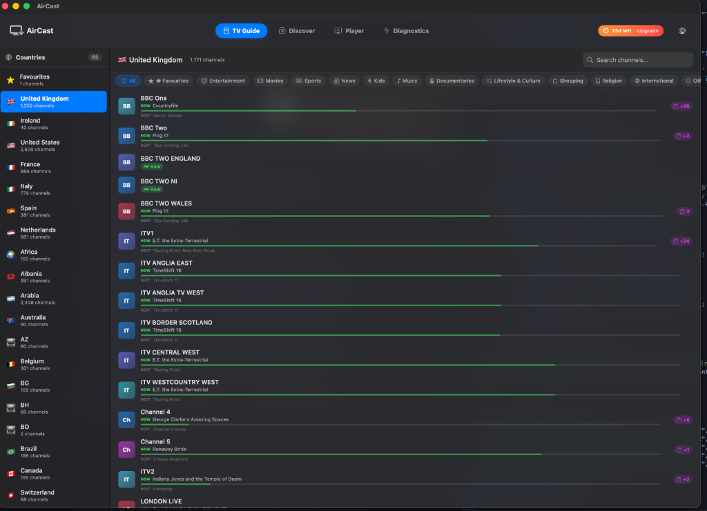
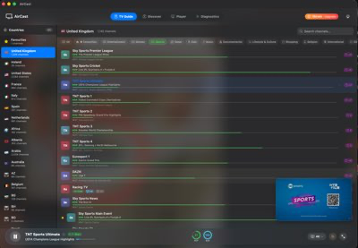
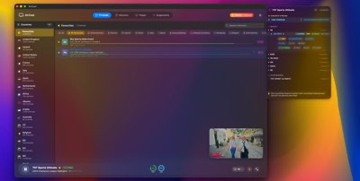
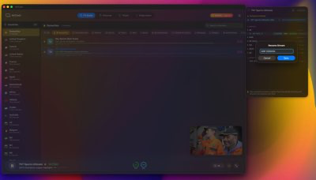
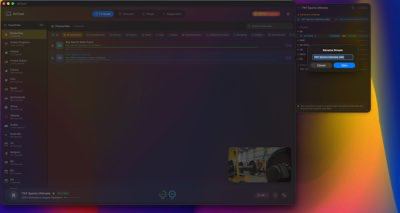
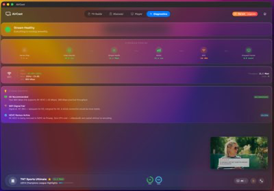
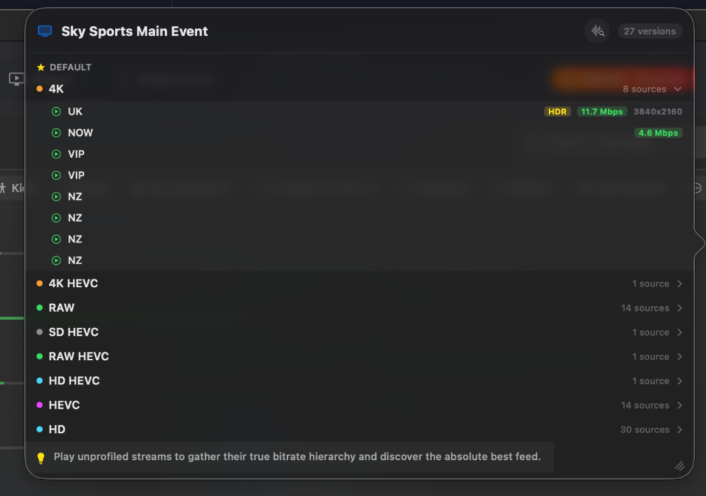

# AirCast — Premium IPTV for macOS & Apple TV 💎

AirCast is a premium **Xtream & M3U** streaming client built natively for Apple platforms. Engineered from the ground up with Swift and Metal, it delivers the first truly professional-grade IPTV experience on macOS — with intelligent channel management, hardware-accelerated playback, and a design language that feels right at home on your Mac.

*The Liquid Glass interface with streamlined sidebar, integrated EPG progress tracking, and unified global search.*

---

## 📺 TV Guide — Your Channels, Organised

AirCast's intelligent TV Guide automatically maps your provider's raw M3U/Xtream channels to real UK Freeview/Sky logical positions. Browse by country, filter by category (Sports, Movies, News, Kids), and see what's on right now — complete with live programme titles, time-accurate progress bars, and "Next Up" info.

The guide groups regional duplicates (BBC One London, BBC One West, etc.) into a single channel row, keeping your lineup clean while still giving you access to every variant.

*The TV Guide showing UK channels in Sky order, with real-time EPG data, colour-coded progress bars, and the mini player docked at the bottom.*

---

## ⭐ Favourites & Stream Selection

Pin your most-watched channels to a dedicated **Favourites** section that sits right at the top of the guide. When you open the stream popout, your favourited streams are marked with a ⭐ so you always know which sources you've saved.

AirCast goes further than any other player by letting you favourite at two levels:
- **Channel-level**: Pin the whole channel to your Favourites bar.
- **Stream-level**: Pin a specific source (e.g., the 4K HEVC feed from your fastest CDN) so it auto-launches without the picker.

*The stream selection popout showing all available sources for a channel — quality tiers, codecs, and favourited streams all in one place.*

---

## ✏️ Rename Streams — Make It Yours

Generic provider labels like "VIP: SKY SPORT 1 ᴴᴰ" aren't helpful when you're choosing between sources. AirCast lets you **rename any stream** to something meaningful — "4K Main", "Backup HD", or whatever makes sense to you. Your custom names persist across sessions.

*Right-click any stream in the popout to open the rename dialog.*

*Custom names appear instantly in the picker, making source selection effortless.*

---

## 🩺 Stream Diagnostics — Under the Hood

For power users and troubleshooters, AirCast includes a full **Diagnostics** tab that monitors every active connection in real time. At a glance you can see:

- **Stream Health**: Green/amber/red status with connection quality summary
- **Network Stats**: Download speed, bitrate, buffer health, and packet loss
- **AI Recommendations**: The diagnostics engine analyses your setup and suggests actionable fixes — like switching CDN, lowering quality, or flagging ISP throttling
- **Codec & Resolution**: Confirm you're actually receiving the HEVC/4K/HDR stream you selected

*The Diagnostics tab showing real-time health monitoring, per-stream network metrics, and AI-powered recommendations for optimal playback.*

---

## 🔍 Intelligent EPG Engine

AirCast's **Sentient Channel Matcher** goes beyond basic string matching. It normalises plurals ("Sports" ↔ "Sport"), strips provider prefixes and quality tags, handles regional suffixes, and cross-references UK Freeview/Sky channel numbers — all to ensure your guide data is as accurate as possible, even when your provider's playlist is messy.

*Unified source selection showing categorised quality tiers (4K, RAW, HD) with real-time bitrate data and codec information.*

---

## 🏆 Why AirCast?

While Android users have enjoyed **TiviMate**, macOS has long lacked a native, premium-grade streaming experience. AirCast bridges that gap:

| Feature | AirCast | TiviMate | Smarters / GSE |
| :--- | :---: | :---: | :---: |
| **Native macOS Design** | ✅ Liquid Glass | ❌ Emulator only | ⚠️ Basic |
| **Auto Channel Grouping** | ✅ Regional Logic | ❌ Manual only | ❌ |
| **Stream-Level Favourites** | ✅ | ❌ | ❌ |
| **Stream Renaming** | ✅ | ❌ | ❌ |
| **Metal/AVF Performance** | ✅ | ❌ | ⚠️ |
| **Live Diagnostics** | ✅ AI-Powered | ❌ | ❌ |
| **EPG Fuzzy Matching** | ✅ Sentient Engine | ⚠️ | ❌ |
| **Apple TV Support** | ✅ Native tvOS | ❌ | ⚠️ |

---

## 📥 Download

| Platform | Download | Requirements |
|---|---|---|
| **macOS** | [Download DMG](https://github.com/JordanH22/aircast/releases/latest) | macOS 14.0 (Sonoma) or later |
| **Apple TV** | [Download IPA](https://github.com/JordanH22/aircast/releases/latest) | tvOS 17.0 or later |

### macOS Installation
1. Download `AirCast-macOS.dmg` from the latest release.
2. Drag **AirCast** to your **Applications** folder.
3. Launch and sign in with your **Xtream API** credentials or load an **M3U Playlist**.

*Drag and drop to install.*

### Apple TV Installation
Distributed as a sideloadable `.ipa` — install via [Sideloadly](https://sideloadly.io), Apple Configurator 2, or Xcode.

> **Note:** Free Apple IDs require re-signing every 7 days. A paid Developer account extends this to 365 days.

---

## 🔑 Licensing & Free Trial

AirCast comes with a **14-day free trial** — full access, no credit card required. One license covers both macOS and Apple TV (up to 3 devices).

| Plan | Price | Link |
|---|---|---|
| **Annual** | £7.99/year | [Purchase →](https://buy.stripe.com/cNiaEQ8Htb78cPDebrcbC00) |
| **Lifetime** | £19.99 once | [Purchase →](https://buy.stripe.com/8x27sE3n9grseXL0kBcbC01) |

---

## 🔄 Auto-Updates

AirCast includes built-in Sparkle support for seamless background updates. You'll be notified automatically when a new version is available.

## 🛡️ Privacy

AirCast does not collect, store, or transmit any personal data. Your IPTV credentials are stored locally on-device. License validation checks your key status only — no usage tracking, no analytics, no telemetry.

---

   
  Built with ❤️ in the UK 
  © 2025 AirCast. All rights reserved. 
  Source code is private. This repository is for distribution only.

